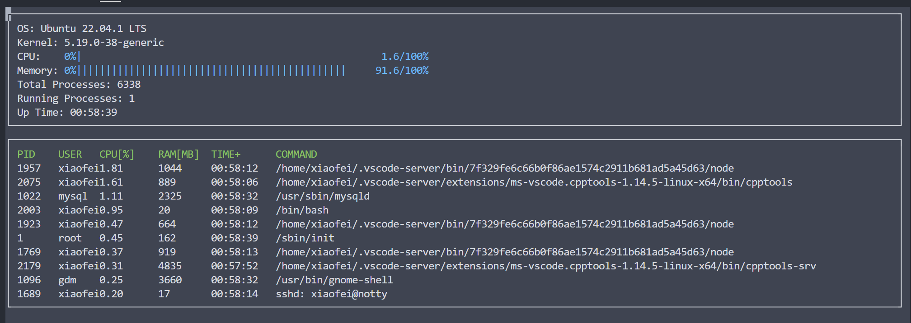

## Linux System Monitor
**Based on**

- Pure C++
- Some C++17 new ferture for file I/O
- Built with Cmake
- ncurses for TUI

## Require
- Linux OS
- Cmake >= Version 2.6, 
  run below to install
  ```
  sudo apt-get update
  sudo apt-get install cmake
  ```

- ncurses: text-based graphical output library,
  run ```sudo apt install libncurses5-dev libncursesw5-dev``` to install
- C++ compiler supporting C++17;


## How to run
```
git clone https://github.com/454270186/linux_system_monitor.git

make build
./build/monitor
```

## Resulting executable



## Reference
- Stackoverflow: [How to calculate system memory usage](https://stackoverflow.com/questions/41224738/how-to-calculate-system-memory-usage-from-proc-meminfo-like-htop/41251290#41251290)
- Stackoverflow: [Accurate calculation of CPU usage given in percentage in Linux?](https://stackoverflow.com/questions/23367857/accurate-calculation-of-cpu-usage-given-in-percentage-in-linux)
- Stackoverflow: [How do I get the total CPU usage](https://stackoverflow.com/questions/16726779/how-do-i-get-the-total-cpu-usage-of-an-application-from-proc-pid-stat/16736599#16736599)
- Linux mannual page: [proc(5)](https://man7.org/linux/man-pages/man5/proc.5.html)